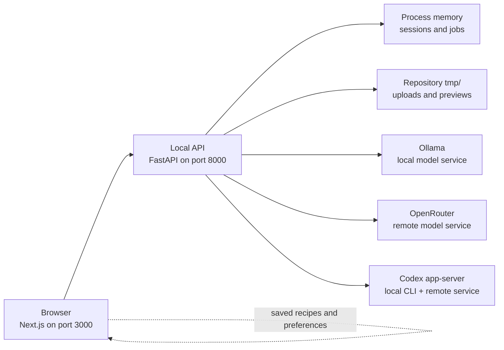

# Cook Mantra

Cook Mantra looks at the ingredients you have and helps you turn them into something you can cook. You can upload a photo or type the ingredients yourself. The app asks you to check the list, suggests several dishes, and writes complete recipes for the dishes you choose.

The project runs on your own computer. There is no Cook Mantra account, subscription, hosted service, or cloud database. You choose which AI provider does the model work: local Ollama, remote OpenRouter, or the experimental Codex integration.

Cook Mantra is open source under the MIT License. You may fork it, change it, redistribute it, or use it in a commercial product.

## Contents

- [What the app does](#what-the-app-does)
- [What local-first means](#what-local-first-means)
- [How the pieces fit together](#how-the-pieces-fit-together)
- [Choose a model provider](#choose-a-model-provider)
- [Switch model providers](#switch-model-providers)
  - [Switch to Ollama](#switch-to-ollama)
  - [Switch from Ollama to OpenRouter](#switch-from-ollama-to-openrouter)
  - [Switch from Ollama to the Codex CLI](#switch-from-ollama-to-the-codex-cli)
- [Quick start with Ollama](#quick-start-with-ollama)
- [Create your first recipe](#create-your-first-recipe)
- [What is stored and what leaves your computer](#what-is-stored-and-what-leaves-your-computer)
- [Provider configuration reference](#provider-configuration-reference)
- [Environment variables](#environment-variables)
- [Troubleshooting](#troubleshooting)
- [Developer reference](#developer-reference)
- [Forking and commercial use](#forking-and-commercial-use)

## What the app does

Suppose you have paneer, tomatoes, and a few vegetables but no recipe in mind. Cook Mantra takes you through four steps:

1. **Add ingredients.** Take a photo, choose a photo from your gallery, or type the ingredients.
2. **Check the list.** Correct anything the model got wrong. Add pantry items such as salt or oil only if you really have them.
3. **Choose an idea.** Set preferences such as diet, cuisine, allergens, servings, and spice level. Cook Mantra suggests text-only dish ideas that fit the confirmed ingredients.
4. **Cook the recipe.** Select one or more ideas. A separate Recipe Writer creates each complete recipe with quantities, numbered steps, cooking time, substitutions, and doneness cues.

The app follows one rule throughout the journey: **an ingredient is available only after you confirm it.** A common ingredient is never silently added just because many kitchens have it.

Every ingredient has one of these sources:

- **Detected** — found in the uploaded photo
- **Pantry suggestion** — proposed because it is commonly used
- **Added by you** — typed manually

Recipe-option cards are always text-only. After a complete recipe is written, an optional image role may try to create one clearly labelled **AI image** of the finished dish. A failed or disabled preview never removes the text recipe.

You can save a completed recipe in the browser, download it as Markdown, request more ideas without repeating earlier ones, and switch between light and dark themes.

## What local-first means

“Local-first” describes where Cook Mantra itself runs and stores its state:

- The web interface runs at `http://localhost:3000`.
- The FastAPI backend runs at `http://127.0.0.1:8000`.
- Active sessions and background jobs live in the backend process's memory.
- Saved recipes, pantry defaults, theme choice, and privacy acknowledgements live in the browser's local storage.
- Uploaded files and generated previews use temporary storage under this repository's ignored `tmp/` directory.
- Cook Mantra has no built-in account system, billing, managed hosting, or cloud persistence.

Local-first does **not** mean every model provider is local. Ollama can keep model work on the computer. OpenRouter is a remote service. Codex starts through a local CLI process, but the selected content may still be sent to OpenAI's service through the Codex-managed connection.

## How the pieces fit together



The browser never talks directly to a model provider. It sends requests to the local API. The API checks the selected provider, model, and capability before it starts model work.

The API has four provider-neutral roles:

| Role                 | What it does                               | Required capability          |
| -------------------- | ------------------------------------------ | ---------------------------- |
| Ingredient Extractor | Reads an accepted ingredient photo         | Vision and structured output |
| Master Chef          | Suggests practical dish ideas              | Text and structured output   |
| Recipe Writer        | Writes one selected recipe                 | Text and structured output   |
| Image Generator      | Optionally creates a finished-dish preview | Raster image output          |

The first three roles are required for the full photo-to-recipe journey. The Image Generator is optional and disabled in the default configuration.

## Choose a model provider

Cook Mantra supports three runtime providers. You can use one provider for every role or mix providers role by role.

| Provider       | Good choice when                                                        | Important trade-off                                                                                      |
| -------------- | ----------------------------------------------------------------------- | -------------------------------------------------------------------------------------------------------- |
| **Ollama**     | You want the default setup and want model work to stay on your computer | Your computer must have enough memory and compute for the selected models                                |
| **OpenRouter** | You want remote models without running them on your own hardware        | It needs an API key, may cost money, and sends selected prompts, outputs, and photos to a remote service |
| **Codex**      | You want to experiment with the official Codex CLI connection           | It requires an explicit risk opt-in, may send content to OpenAI, and is intended for a trusted personal machine |

Start with Ollama unless you already know that you want OpenRouter. The repository's tracked configuration is ready for Ollama.

Cook Mantra never switches to another provider or model behind your back. If a configured model is unavailable or lacks a required capability, the affected role reports that it needs attention.

### Codex preview status

The Codex integration uses only the official local `codex app-server` command and an existing Codex-managed sign-in. It is not a generic ChatGPT proxy, and Cook Mantra never asks for or stores ChatGPT credentials.

Codex is currently a technical preview. By default, its text and vision roles fail closed because the audited CLI cannot disable every built-in tool before a turn begins. A trusted personal-machine user can explicitly enable the functional preview with `allow_unverified_tool_boundary: true` in the Codex provider configuration. The safe default is `false`.

That opt-in is a real security trade-off. Cook Mantra uses an empty API-owned working directory, a read-only sandbox, disabled turn network access, no Cook Mantra tools, and an event allowlist. It terminates the child when it observes forbidden shell, file, web, MCP tool-call, collaboration, reasoning, user-input, or reroute activity. The app-server can still initialize MCP servers already configured in the user's Codex setup; Cook Mantra accepts only their startup-status events and rejects an observed MCP tool call. More generally, app-server activity may start before emitting the event Cook Mantra observes and rejects. Event rejection is not the same as preventing that activity from starting. Codex image generation remains unsupported.

For this preview, Cook Mantra sends `effort: none` and `summary: none` on every Codex turn so the app-server does not emit reasoning items. A Codex role's `reasoning_effort` tuning value is therefore not used; keep it set to `none` so the configuration accurately describes the request.

## Switch model providers

**The provider switch is in `config/cook-mantra.yaml`. There is no provider selector in the browser.**

Cook Mantra selects a provider separately for each model role. Inside `roles`, change the `provider` and `model` values for every role you want to move. Keep that role's existing `tuning`, `editable_instruction`, and `capabilities` fields.

The usual process is:

1. Stop Cook Mantra with `Ctrl+C` if it is running.
2. Open `config/cook-mantra.yaml` in your editor.
3. Make sure the provider exists under `providers`.
4. Change `provider` and `model` inside the roles you want that provider to run.
5. Restart Cook Mantra with `pnpm dev`.
6. Check the **Local model status** panel in the browser, or run:

   ```bash
   curl http://127.0.0.1:8000/api/v1/runtime-status
   ```

The API reads the YAML file only when it starts. Editing the file without restarting the API does not change the running application. Cook Mantra also has no automatic fallback: every configured provider and model must be available.

The tracked `config/cook-mantra.example.yaml` file contains a redacted example that uses Ollama, OpenRouter, and Codex in the same setup. Use it as a reference; keep your active choices in `config/cook-mantra.yaml`.

### Switch to Ollama

The tracked configuration already uses Ollama. Its provider entry is:

```yaml
providers:
  ollama:
    endpoint: http://127.0.0.1:11434
```

To move the three required roles back to the default local models, change only their `provider` and `model` lines:

| Role                   | Provider | Model         |
| ---------------------- | -------- | ------------- |
| `ingredient_extractor` | `ollama` | `qwen3.5:9b`  |
| `master_chef`          | `ollama` | `gpt-oss:20b` |
| `recipe_writer`        | `ollama` | `gpt-oss:20b` |

Make sure Ollama is running and download those models before restarting Cook Mantra:

```bash
ollama pull qwen3.5:9b
ollama pull gpt-oss:20b
```

The optional `image_generator` role is disabled by default. Leave it disabled unless you have configured a compatible image-output model.

### Switch from Ollama to OpenRouter

OpenRouter runs models remotely. It requires an API key and exact model slugs from the [OpenRouter model catalog](https://openrouter.ai/models).

1. Add your key to the root `.env` file. Never put the key in YAML or commit it:

   ```text
   OPENROUTER_API_KEY=replace-with-your-key
   ```

2. Add this entry under `providers` in `config/cook-mantra.yaml`. You may keep the Ollama entry as well:

   ```yaml
   providers:
     openrouter:
       endpoint: https://openrouter.ai/api/v1
       api_key_env: OPENROUTER_API_KEY
   ```

3. In each role you want OpenRouter to run, change these two lines:

   ```yaml
   provider: openrouter
   model: provider/model-name
   ```

   Replace `provider/model-name` with a real OpenRouter slug. The Ingredient Extractor needs a model with image input and structured output. The Master Chef and Recipe Writer need text and structured output. Keep the existing `capabilities` list unchanged; it tells Cook Mantra what the selected model must support.

4. Restart Cook Mantra and check runtime status. If you want every required role on OpenRouter, repeat step 3 for `ingredient_extractor`, `master_chef`, and `recipe_writer`.

You can also leave `ingredient_extractor` on Ollama and move only the two text roles to OpenRouter. This keeps ingredient photos on your computer while sending recipe prompts and outputs to OpenRouter.

### Switch from Ollama to the Codex CLI

The Codex integration uses the official local `codex app-server` as a bridge. The CLI runs on your computer, but content selected for a Codex role may still go to OpenAI through your Codex-managed connection.

1. Install the official [Codex CLI](https://developers.openai.com/codex/cli/).
2. Run `codex` once and complete its own sign-in. Cook Mantra does not ask for or store your ChatGPT credentials.
3. Add this entry under `providers` in `config/cook-mantra.yaml`:

   ```yaml
   providers:
     codex:
       command: [codex, app-server]
       allow_unverified_tool_boundary: true
   ```

   The opt-in is normally `false`. Set it to `true` only on a trusted personal machine after reading the preview boundary above. Cook Mantra reads this setting only when the API starts.

4. Set all three required roles to the exact Codex model:

   ```yaml
   roles:
     ingredient_extractor:
       provider: codex
       model: gpt-5.6-sol
       # Keep the role's existing tuning, instruction, and capabilities.
     master_chef:
       provider: codex
       model: gpt-5.6-sol
       # Keep the role's existing tuning, instruction, and capabilities.
     recipe_writer:
       provider: codex
       model: gpt-5.6-sol
       # Keep the role's existing tuning, instruction, and capabilities.
   ```

   `gpt-5.6-sol` is the exact Codex model used by this setup and supports text and image input. Cook Mantra checks the signed-in account's live Codex model catalog, so runtime status reports if that exact model is unavailable to the account or workspace.

5. Keep `image_generator.enabled: false`. Codex image output is unsupported.
6. Restart the API, then refresh **Local model status** or read `/api/v1/runtime-status`. Do not start `codex app-server` yourself; the API starts and owns that child process.

Prompts, accepted ingredient photos, and responses used by Codex roles may be sent to OpenAI through the Codex-managed sign-in. Cook Mantra never handles ChatGPT credentials directly. The opt-in acknowledges that forbidden built-in activity may begin before Cook Mantra receives and rejects its event. Use Ollama or OpenRouter if that boundary is not acceptable.

## Quick start with Ollama

The following setup is the shortest route to a working local installation.

Using OpenRouter instead? Complete steps 1 through 5, follow [Switch from Ollama to OpenRouter](#switch-from-ollama-to-openrouter), skip the Ollama model download, and continue at step 7. For the Codex preview, follow the same base setup and then [Switch from Ollama to the Codex CLI](#switch-from-ollama-to-the-codex-cli).

### 1. Check the supported platform

The secure temporary-artifact implementation is currently supported on:

- macOS
- Linux with `/proc` mounted

Native Windows support is not currently claimed. Windows developers can experiment through a Linux environment such as WSL, but that path is not part of the tested project contract.

### 2. Install the required tools

You need:

- [Git](https://git-scm.com/downloads)
- Node.js 22 or newer
- pnpm 10.28.1, the version pinned in `package.json`
- [uv](https://docs.astral.sh/uv/getting-started/installation/)
- [Ollama](https://docs.ollama.com/quickstart), only when you use the Ollama provider

If Node.js is installed but pnpm is missing, Corepack can use the version pinned by this repository:

```bash
corepack enable pnpm
```

Check the tools before continuing:

```bash
git --version
node --version
pnpm --version
uv --version
```

If you plan to use Ollama, check it separately:

```bash
ollama --version
```

The Node.js version must start with `v22` or a higher number. `uv` can install the required Python 3.13 runtime automatically. To install it explicitly, run:

```bash
uv python install 3.13
```

### 3. Clone the repository

```bash
git clone https://github.com/samarthmn/cook-mantra.git
cd cook-mantra
```

If you already cloned the repository, open a terminal in its root directory instead.

### 4. Create local configuration files

The tracked example files contain safe defaults and no secrets:

```bash
cp example.env .env
cp apps/web/.env.example apps/web/.env.local
```

The web example points the browser at the local API:

```text
NEXT_PUBLIC_COOK_MANTRA_API_URL=http://127.0.0.1:8000/api/v1
```

Do not commit `.env` or `.env.local`. They are ignored because they may contain machine-specific settings or secrets.

### 5. Install JavaScript dependencies

Run this from the repository root:

```bash
pnpm install
```

The backend uses its own Python lockfile. The first `uv run` command creates the Python environment and installs the locked backend dependencies automatically.

### 6. Download the default Ollama models

Make sure the Ollama application or service is running, then download the two models named in `config/cook-mantra.yaml`:

```bash
ollama pull qwen3.5:9b
ollama pull gpt-oss:20b
```

The first model reads ingredient photos. The second suggests dishes and writes recipes. Model downloads can be large and may take some time.

Confirm that Ollama knows about both models:

```bash
ollama list
```

### 7. Start Cook Mantra

```bash
pnpm dev
```

Keep this terminal open. It starts both applications:

- Web interface: `http://localhost:3000`
- API: `http://127.0.0.1:8000`
- API documentation: `http://127.0.0.1:8000/docs`

Open `http://localhost:3000` in a browser. The **Local model status** panel should show the three required roles as ready. The optional Dish Preview role may be disabled or need attention without blocking text recipes.

To stop both applications, return to the terminal and press `Ctrl+C`.

## Create your first recipe

### 1. Check model status

The first screen shows the selected provider and model for each role. If a required role says **Needs attention**, open the troubleshooting section before uploading a photo.

### 2. Add ingredients

Choose one method:

- **Take a photo** on a device with a camera
- **Choose from gallery** to upload an existing JPEG, PNG, or WebP file up to 10 MB
- **Type ingredients instead** to skip photo recognition

Before a remote provider receives a photo, Cook Mantra names the exact provider and model and asks for permission. Choosing manual entry sends no photo.

### 3. Review the ingredient list

Photo recognition is a starting point, not a fact. On the confirmation screen you can:

- rename an ingredient;
- remove a wrong detection;
- add something the photo missed;
- select only the pantry suggestions you have; and
- edit the default pantry list for future sessions.

Nothing becomes available to a recipe until it is selected and confirmed.

### 4. Set preferences

You can choose:

- vegetarian or non-vegetarian;
- a diet style such as vegan, Jain, halal, or kosher;
- add-ons such as keto or no onion and garlic;
- allergens to avoid;
- up to 20 preferred cuisines;
- one, two, or four servings;
- three, four, or six recipe ideas; and
- a spice level.

These preferences guide generation, but the confirmed ingredient list remains the source of truth.

### 5. Generate and choose ideas

The Master Chef produces text-only recipe options. Each option shows its cuisine, estimated time, difficulty, ingredient fit, and any missing ingredients.

Select one or more options and choose **Create recipes**. You can also choose **More ideas**. Cook Mantra remembers ideas shown in the current session and asks for a fresh batch without repeating them.

### 6. Use the completed recipe

Each selected option gets its own Recipe Writer. The writers can work in parallel, although the local runtime limits simultaneous model calls so it does not overwhelm the machine.

A completed recipe includes ingredients, quantities, servings, timing, numbered steps, tips, substitutions, and availability notes. You can mark steps as completed while cooking.

You can also:

- save the recipe in this browser;
- open it later from **Saved recipes**;
- download it as a Markdown file; or
- remove it from the browser cookbook.

Saved recipe text remains in browser storage after the API restarts. Temporary generated previews do not become permanent cloud assets.

## What is stored and what leaves your computer

The storage boundary depends on the type of data and the selected provider.

| Data                                   | Where it lives                           | How long it lasts                                        |
| -------------------------------------- | ---------------------------------------- | -------------------------------------------------------- |
| Active cooking session                 | FastAPI process memory                   | Until expiry or API restart                              |
| Background job state                   | FastAPI process memory                   | Until expiry or API restart                              |
| Saved recipe text                      | Browser local storage                    | Until you remove it or clear browser data                |
| Pantry defaults and theme              | Browser local storage                    | Until changed or browser data is cleared                 |
| Remote-photo acknowledgement           | Browser local storage                    | Until the destination changes or browser data is cleared |
| Uploaded photos and generated previews | Repository-local `tmp/` storage          | Temporary; cleaned by the local runtime                  |
| Provider and role configuration        | Local YAML files                         | Until you edit the files                                 |
| API keys                               | Local environment or ignored `.env` file | Until you change or remove them                          |

### Ollama

Ollama ingredient recognition counts as local only when its configured endpoint is `localhost` or a numeric loopback address such as `127.0.0.1`. With that setup, Cook Mantra sends model requests to the Ollama process on the same computer.

### OpenRouter

OpenRouter is remote. A role configured for OpenRouter sends that role's prompts and model outputs to OpenRouter. If the Ingredient Extractor uses OpenRouter, the accepted ingredient photo is sent as well. OpenRouter usage may incur provider charges.

### Codex

Cook Mantra starts a local `codex app-server` child process and uses the sign-in already managed by the official Codex CLI. Content selected for a Codex role may leave the computer through that service. Cook Mantra does not handle the ChatGPT credential itself.

### LangSmith

LangSmith tracing is optional and disabled by default. When enabled, Cook Mantra records bounded operational metadata such as role/provider/model identity, job correlation, token counts, media type, byte count, detected-item count, and warning count. It never sends prompts, model outputs, raw provider responses, or ingredient-image bytes to LangSmith.

### What Cook Mantra does not provide

This repository has no:

- managed Cook Mantra server;
- user registration or authentication;
- cloud recipe backup or multi-device sync;
- billing, credits, or subscriptions;
- hosted database; or
- production access control for a public network.

The default servers bind to loopback addresses and are intended for one trusted local user. If you expose them to a network, you are responsible for authentication, TLS, isolation, durable storage, rate limits, and operational security.

## Provider configuration reference

Cook Mantra reads model configuration from `config/cook-mantra.yaml` when the API starts. Restart the API after every YAML change because provider discovery is cached for the life of the process.

The [switching guide](#switch-model-providers) above covers the practical steps. This section explains the configuration contract in more detail.

The redacted `config/cook-mantra.example.yaml` shows all three providers. Secret values never belong in YAML. The YAML stores only the name of an environment variable that contains a secret.

### Configuration shape

The file has three important parts:

```yaml
version: 1

providers:
  # Connection information for Ollama, OpenRouter, or Codex

roles:
  # One provider, model, capability list, and tuning block per role
```

Every enabled role names:

- a provider;
- an exact model;
- bounded tuning values;
- one editable instruction; and
- the capabilities the application expects.

Unknown fields, literal secrets, template syntax, incompatible provider shapes, and invalid role capabilities are rejected when configuration loads.

### Ollama configuration

The tracked file already uses Ollama:

```yaml
providers:
  ollama:
    endpoint: http://127.0.0.1:11434
```

Role selections use exact local model names:

```yaml
roles:
  ingredient_extractor:
    provider: ollama
    model: qwen3.5:9b
    capabilities: [vision, structured_output]

  master_chef:
    provider: ollama
    model: gpt-oss:20b
    capabilities: [text, structured_output]
```

Do not declare a capability merely because you want it. The selected provider and model must actually advertise it during discovery.

### OpenRouter configuration

1. Create an API key in the [OpenRouter dashboard](https://openrouter.ai/settings/keys).
2. Put the key in the root `.env` file:

   ```text
   OPENROUTER_API_KEY=replace-with-your-key
   ```

3. Add the provider definition:

   ```yaml
   providers:
     openrouter:
       endpoint: https://openrouter.ai/api/v1
       api_key_env: OPENROUTER_API_KEY
   ```

4. Select OpenRouter on the roles you want to move:

   ```yaml
   roles:
     master_chef:
       provider: openrouter
       model: provider/model-name
       capabilities: [text, structured_output]
   ```

OpenRouter model names use a `provider/model` slug. Choose current model slugs from the [OpenRouter model catalog](https://openrouter.ai/models). Check that a vision role accepts image input and that every required role supports structured output. The repository does not silently route to a different model when the chosen one fails.

If YAML uses a custom `api_key_env` name instead of `OPENROUTER_API_KEY`, export that variable in the API process environment. Only the standard name is mapped from the root `.env` file.

### Codex configuration

1. Install the official [Codex CLI](https://developers.openai.com/codex/cli/).
2. Run `codex` and complete the Codex-managed sign-in.
3. Add the provider command:

   ```yaml
   providers:
     codex:
       command: [codex, app-server]
       allow_unverified_tool_boundary: true
   ```

   The safe default is `false`. Change it to `true` only for the functional preview on a trusted personal machine, then restart the API.

4. Select Codex for the required text and vision roles with the exact model:

   ```yaml
   roles:
     recipe_writer:
       provider: codex
       model: gpt-5.6-sol
   ```

   Change the `provider` and `model` lines in your existing role, keep its instruction and capabilities, and set `reasoning_effort: none`. The runtime verifies that `gpt-5.6-sol` appears in the model catalog for the signed-in account. The current Codex preview always sends `effort: none` and `summary: none`, even if another reasoning value remains in role tuning.

Do not start `codex app-server` yourself. The API owns one child process and starts it lazily for discovery or invocation. It does not forward OpenRouter, LangSmith, or unrelated process secrets to that child.

With the opt-in omitted or `false`, the safety gate intentionally keeps Codex roles unready. With it set to `true`, matching text and vision roles can run. Cook Mantra rejects forbidden activity after observing its app-server event, but the activity may have started before that event arrives. Content used by Codex roles may be sent to OpenAI through the Codex-managed sign-in. Codex image output remains unsupported.

### Mixing providers

Roles are independent. For example, you can keep photo recognition in local Ollama and use OpenRouter for recipe writing. This avoids sending ingredient photos remotely while letting a remote text model write recipes.

When providers are mixed:

- each role keeps its exact configured provider and model;
- no role falls back to another selection;
- the runtime-status panel reports readiness per role; and
- only the content used by a remote role is sent to that provider.

## Environment variables

### Backend: root `.env`

Copy `example.env` to `.env`. The main settings are:

| Variable             | Purpose                                                                            |
| -------------------- | ---------------------------------------------------------------------------------- |
| `LOG_LEVEL`          | Backend log verbosity; defaults to `INFO`                                          |
| `OPENROUTER_API_KEY` | Required only when a role uses OpenRouter                                          |
| `CORS_ORIGINS`       | Exact browser origins allowed to call the API                                      |
| `ARTIFACT_ROOT`      | Temporary artifact directory; it must stay under the repository's `tmp/` directory |
| `LANGSMITH_TRACING`  | Enables optional tracing when set to `true`                                        |
| `LANGSMITH_API_KEY`  | LangSmith credential when tracing is enabled                                       |
| `LANGSMITH_PROJECT`  | LangSmith project name                                                             |

`COOK_MANTRA_CONFIG_PATH` may point to another runtime YAML file. This is useful when you keep separate local configurations for different machines or providers.

The live-test flags in `example.env` are for developers. They do not affect normal application use.

### Web: `apps/web/.env.local`

The browser needs one public value:

```text
NEXT_PUBLIC_COOK_MANTRA_API_URL=http://127.0.0.1:8000/api/v1
```

Change it only if you deliberately run the local API at another address. Restart the Next.js process after changing browser environment values.

## Troubleshooting

### `pnpm: command not found`

Confirm that Node.js 22 or newer is installed, then enable pnpm through Corepack:

```bash
corepack enable pnpm
pnpm --version
```

If Corepack reports a signature or installation problem, follow the current [pnpm installation guide](https://pnpm.io/installation).

### `uv: command not found`

Install uv using the [official installation guide](https://docs.astral.sh/uv/getting-started/installation/), open a new terminal, and run:

```bash
uv --version
uv python install 3.13
```

### The web page says it cannot connect to the kitchen

The browser cannot reach the local API. Check the API directly:

```bash
curl http://127.0.0.1:8000/api/v1/health
```

A healthy process returns JSON with `"status":"ok"`. If the connection fails, check the terminal running `pnpm dev` for a backend startup error. Also confirm that `apps/web/.env.local` points to `http://127.0.0.1:8000/api/v1`.

### Ollama is unavailable

Make sure the Ollama application or service is running. Then check its local API and model inventory:

```bash
curl http://127.0.0.1:11434/api/tags
ollama list
```

If either default model is missing, pull it again:

```bash
ollama pull qwen3.5:9b
ollama pull gpt-oss:20b
```

The names in `ollama list` and `config/cook-mantra.yaml` must match exactly.

### A role says `Needs attention`

Read the safe runtime snapshot:

```bash
curl http://127.0.0.1:8000/api/v1/runtime-status
```

Check the role's provider, model, capabilities, and normalized error. Common causes are:

- the provider service is not running;
- the API key is missing;
- the exact model is not installed or no longer exists;
- a vision model does not accept images;
- a model does not support structured output; or
- a Codex role still has the default `allow_unverified_tool_boundary: false` setting;
- the Codex CLI is not signed in, or `gpt-5.6-sol` is unavailable to that account; or
- the API was not restarted after changing the Codex provider setting.

The endpoint deliberately omits credentials, provider commands, and private inventories.

### OpenRouter authentication fails

Confirm that:

- the root `.env` contains `OPENROUTER_API_KEY`;
- the YAML uses `api_key_env: OPENROUTER_API_KEY`;
- the key is active in OpenRouter; and
- you restarted the API after editing `.env` or YAML.

Never print the key in logs or commit it to Git.

### A photo disclosure appears

This is expected when the Ingredient Extractor uses OpenRouter or Codex. The dialog shows where the photo will go. Continue only if you accept that destination. Choose manual ingredient entry to send no photo.

The acknowledgement is tied to the exact provider, model, and disclosure version. A configuration change asks again.

### The Dish Preview role is disabled or unavailable

Text recipes still work. The image role is optional and disabled by default. Even when enabled, image generation fails closed unless provider discovery proves the exact configured size, quality, format, and endpoint.

Codex image output is unsupported. Current Ollama and OpenRouter image combinations may also remain unavailable when they cannot prove every setting. No image request is made when the safety checks fail.

### Recipes disappeared after an API restart

The active cooking session is process-local, so this is expected. Recipes explicitly saved through **Saved recipes** remain in that browser's local storage. They disappear if browser data is cleared, private browsing ends, or another browser/profile is used.

### A port is already in use

Another process already owns port `3000` or `8000`. Stop the old Cook Mantra process or the conflicting application, then run `pnpm dev` again. If you deliberately change a port, update the API command, CORS origin, and `NEXT_PUBLIC_COOK_MANTRA_API_URL` together.

## Developer reference

### Technology stack

| Area               | Main technology                                                              |
| ------------------ | ---------------------------------------------------------------------------- |
| Web                | Next.js 16, React 19, TypeScript 6, Vitest                                   |
| API                | Python 3.13, FastAPI, Pydantic, LangGraph                                    |
| Model runtime      | Native Ollama, OpenRouter, and Codex app-server adapters                     |
| Package management | pnpm workspace for web code, uv for Python code                              |
| Storage            | Browser local storage, process memory, and temporary project-local artifacts |

### Repository map

```text
cook-mantra/
├── apps/
│   ├── web/                    # Next.js interface
│   │   └── src/
│   │       ├── app/            # Routes and global styles
│   │       ├── components/     # Shared UI components
│   │       ├── features/       # Cooking journey and saved recipes
│   │       └── lib/api/        # Typed local API client
│   └── api/                    # FastAPI backend
│       ├── src/
│       │   ├── agents/         # Ingredient, idea, and recipe roles
│       │   ├── api/            # App construction, middleware, and routes
│       │   ├── orchestration/  # LangGraph workflows and job runner
│       │   ├── repositories/   # In-memory session and job stores
│       │   └── services/       # Providers, artifacts, tracing, and cleanup
│       ├── tests/              # Unit, integration, end-to-end, and live tests
│       └── README.md           # Detailed API and provider reference
├── config/                     # Runtime provider and role YAML
├── docs/                       # Product, architecture, and UI documentation
├── tmp/                        # Ignored runtime and task files
├── example.env                 # Safe backend environment example
├── LICENSE                     # MIT license
└── package.json                # Root development commands
```

See the [folder structure](docs/folder-structure.md) for the maintained repository map and the [architecture document](docs/architecture-doc.md) for the state machine, provider boundaries, and workflow details.

### Development commands

Run these from the repository root unless the command changes directory:

| Command              | Purpose                                            |
| -------------------- | -------------------------------------------------- |
| `pnpm dev`           | Start the API and web app together                 |
| `pnpm api:dev`       | Start only FastAPI on `127.0.0.1:8000`             |
| `pnpm web:dev`       | Start only Next.js on `127.0.0.1:3000`             |
| `pnpm web:test`      | Run deterministic web tests                        |
| `pnpm web:typecheck` | Run the TypeScript compiler without emitting files |
| `pnpm web:lint`      | Run ESLint with zero warnings allowed              |
| `pnpm web:build`     | Create a production Next.js build                  |

Backend checks run from `apps/api`:

```bash
cd apps/api
uv run pytest -m "not live"
uv run ruff check .
uv lock --check
```

Provider and LangSmith live checks are opt-in. Do not run them as part of an ordinary deterministic test pass. The guarded commands are documented in the [API guide](apps/api/README.md).

### Local API

Useful endpoints:

| Method and path                                          | Purpose                                                   |
| -------------------------------------------------------- | --------------------------------------------------------- |
| `GET /api/v1/health`                                     | Check whether the API process is alive                    |
| `GET /api/v1/ready`                                      | Check required model-role readiness                       |
| `GET /api/v1/runtime-status`                             | Read the browser-safe provider/model status for all roles |
| `POST /api/v1/sessions`                                  | Start a photo-based ingredient session                    |
| `POST /api/v1/sessions/manual`                           | Start with typed ingredients                              |
| `GET /api/v1/sessions/{session_id}`                      | Read current session state                                |
| `PUT /api/v1/sessions/{session_id}/ingredients`          | Edit reviewed ingredients                                 |
| `POST /api/v1/sessions/{session_id}/ingredients/confirm` | Confirm the final list                                    |
| `POST /api/v1/sessions/{session_id}/recipe-options`      | Queue the first idea batch                                |
| `POST /api/v1/sessions/{session_id}/recipe-options/more` | Queue a fresh, non-repeating batch                        |
| `POST /api/v1/sessions/{session_id}/recipes`             | Queue complete recipes                                    |
| `GET /api/v1/jobs/{job_id}`                              | Poll background work                                      |
| `GET /api/v1/artifacts/{artifact_id}`                    | Read a temporary generated image                          |

Interactive OpenAPI documentation is available at `http://127.0.0.1:8000/docs` while the API is running. The stable contract is tested in `apps/api/tests/integration/api/test_openapi.py`.

### Runtime behavior worth knowing

- The API holds sessions and jobs in memory; it is a single-process local application.
- Model work runs as bounded background jobs so HTTP requests do not wait for slow generation.
- Complete recipes for multiple selections can run in parallel, subject to the global model-call limit.
- Configuration and provider discovery are cached until API restart.
- Uploaded browser photos carry the runtime revision that the browser checked before disclosure.
- A stale revision returns a safe conflict response before the request body is consumed.
- Provider errors are normalized before they reach the browser.
- No provider or model fallback changes the selection in YAML.

### Documentation map

- [API guide](apps/api/README.md) — API setup, provider behavior, safety boundaries, and live checks
- [Architecture document](docs/architecture-doc.md) — architecture, state flow, jobs, artifacts, and trade-offs
- [Folder structure](docs/folder-structure.md) — source tree and module responsibilities
- [Product requirements](docs/prd.md) — product rules and user journey
- [UI style guide](docs/ui-style-guide.md) — visual system and interface contracts
- [Provider configuration example](config/cook-mantra.example.yaml) — redacted examples for all providers
- [Environment example](example.env) — backend environment-variable reference

## Forking and commercial use

The MIT License allows personal, academic, open-source, and commercial use. You may:

- fork the repository;
- modify any part of the application;
- redistribute the original or a modified version;
- include it in a paid product; or
- run your own private version.

Keep the copyright and MIT permission notice with copies or substantial portions of the software. The software is provided without warranty; read the [MIT License](LICENSE) for the exact legal terms.

If you publish a fork, document your own provider choices, data handling, authentication, storage, and deployment model. Those decisions belong to your version and are not managed by this repository.
