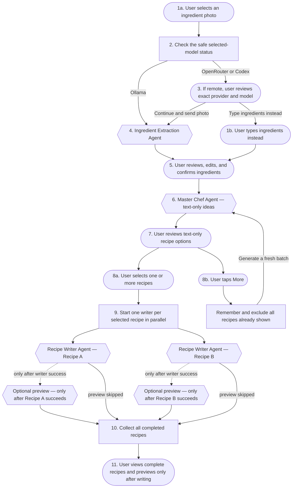

# Cook Mantra

## What is Cook Mantra?

Cook Mantra is a recipe generator for people who already have some ingredients at home but are not sure what to cook with them.

## How does it work?

The user takes a photo of the ingredients or types them manually. For a photo, Cook Mantra recognizes what is visible and then asks the user to check the list. It also shows a separate list of common pantry ingredients such as salt, oil, turmeric, chilli powder, cumin, onion, garlic, and ginger. The user can confirm, add, edit, or remove anything before recipes are generated.

Before a photo is sent, the browser checks the selected ingredient-recognition model. If the photo would go to OpenRouter or Codex, Cook Mantra names the exact provider and model and waits for the user to accept. Ollama ingredient recognition stays on the local loopback service. Manual ingredient entry remains available without sending a photo.

Once the ingredient list is confirmed, Cook Mantra suggests a few text-only dishes and gives each a short summary. The user can select one or more dishes. Cook Mantra then creates every selected recipe in parallel. Only after a complete recipe has been written may the optional image role add a clearly labelled finished-dish preview.

## Why we are building this

A lot of people have ingredients at home but still spend time wondering what to cook. This is especially common when there are only a few vegetables left, or when someone wants to avoid ordering food or wasting ingredients. I personally am a beginner at cooking and I want to learn new recipes with the already existing ingredients. I would want to try something different so for me this kind of app is perfect.

A photo alone is not enough, though. Some ingredients are usually kept in the kitchen and may not appear in the photo. At the same time, the app should not assume that every user has every common spice.

So the important idea here is simple: **Cook Mantra can suggest pantry ingredients, but the user must confirm them.**

## Who this is for

- Home cooks
- Students and people living alone
- Families deciding what to make quickly
- Beginners who need step-by-step instructions
- People trying to use ingredients before they go to waste

## The basic flow

1. The user uploads or takes a photo of the available ingredients, or chooses to type ingredients instead.
2. Before a photo upload, Cook Mantra checks the safe model-runtime status. A remote OpenRouter or Codex destination requires the user to review and accept the exact provider and model first.
3. The Ingredient Extraction Agent detects the likely ingredients from an accepted photo. Manual entry skips this agent.
4. Cook Mantra shows the detected or typed ingredients to the user.
5. The user can add, rename, or remove items.
6. Cook Mantra also shows a separate, editable list of common pantry ingredients.
7. The user confirms which pantry ingredients are actually available.
8. The app creates one final confirmed ingredient list.
9. The Master Chef Agent generates a text-only batch of recipe options using that confirmed list and excluding recipes already shown in the current session.
10. The user selects one or more recipes or requests more options.
11. If the user requests more, only step 9 runs again and produces a fresh text-only batch without repeating previously shown recipes.
12. For each selected option, the backend starts a separate Recipe Writer Agent. These agents run in parallel.
13. Each writer creates one complete recipe with quantities, steps, cooking time, servings, tips, and substitutions.
14. After a writer succeeds, the optional Image Generator Agent may create a finished-dish preview for that complete recipe. A writer failure never starts preview work, and a preview failure never removes the completed text recipe.
15. The backend collects the results and returns all selected recipes together.

The user should also be able to go back and choose another recipe without uploading the image again.

## User and agent flow

Rounded nodes are user actions, rectangles are orchestration steps, and hexagons are agents.

## Local model setup and photo privacy

One local YAML file selects a provider, model, bounded tuning, and one editable instruction for each role. The supported providers are Ollama, OpenRouter, and the local Codex app-server adapter. The roles remain provider-neutral, but their capabilities are not interchangeable: ingredient extraction needs vision and structured output, the two recipe roles need text and structured output, and the optional image role needs raster image output. An incompatible or unavailable selection fails with a safe role-specific error; Cook Mantra never silently falls back to another provider or model.

The browser reads the no-store runtime status before it sends a photo. The status shows the selected provider and model for Ingredient recognition, Recipe ideas, Recipe writing, and Dish preview. A required text or vision role that needs attention blocks the related model work and leaves manual ingredient entry available. The optional Dish preview role may need attention without blocking complete text recipes. Configuration changes take effect after the local API restarts.

For ingredient-photo recognition, Cook Mantra admits Ollama only at a local loopback endpoint. OpenRouter is remote, and Codex may also send a selected photo beyond the device through the signed-in CLI service. Before either remote destination receives ingredient media, the UI says **This photo will leave your device**, shows the exact provider and model, and offers to keep the photo local or type ingredients instead. Acceptance is stored against that exact provider, model, and disclosure version; a destination change asks again. The runtime revision binds a browser upload to the process snapshot the browser checked, but it is concurrency metadata, not consent. If the revision is stale, the browser refreshes status and re-evaluates disclosure before another upload.

The Codex app-server transport and read-only model discovery are implemented, but the audited Codex CLI 0.146.0 cannot disable every built-in tool before a turn begins. Codex text and vision selections therefore fail closed before model-dependent work; there is no fallback. Codex image generation is also unavailable because its schema has no documented request-to-raster handoff. The optional image role supports only image-capable Ollama or OpenRouter selections that prove the configured image tuning exactly.

## One rule we should not break

Cook Mantra must not quietly treat an ingredient as available just because it is common.

Every item should have a source:

- **Detected** — found in the uploaded photo
- **Pantry suggestion** — suggested by Cook Mantra because it is commonly used
- **User added** — manually entered by the user

Only ingredients confirmed by the user should be treated as available.

When a recipe needs something else, Cook Mantra should clearly mark it as:

- Missing
- Optional
- Replaceable with a substitution

## Common pantry ingredients

For the first version, the suggested pantry list may include:

- Salt
- Pepper powder
- Oil or ghee
- Chilli powder
- Onion
- Garlic
- Ginger

This is only a starting list. The user can select, deselect, add, or remove items. Later, the list can change based on cuisine, region, diet, and the user's saved pantry.

## What the first version should include

- Uploading an image from the camera or gallery
- Detecting ingredients from the image
- Showing uncertain detections clearly
- Letting the user add, edit, and remove ingredients
- Showing pantry suggestions separately from image detections
- Requiring confirmation before recipe generation
- Generating several recipe options
- Showing recipe name, summary, time, difficulty, and ingredient fit
- Showing missing or optional ingredients honestly
- An optional completed-recipe dish preview, attempted only after that recipe is written and visibly marked **AI image**
- Selecting one or more recipe options
- Complete recipes for every selected option, generated in parallel
- The ability to return to the recipe options
- The ability to request more recipe options without re-uploading the image or repeating previously shown recipes

## What each agent does

### Ingredient Extraction Agent

Looks at the uploaded image and returns likely ingredients, confidence levels, and uncertain items.

### Confirmation screen

This is not really an AI agent, but it is one of the most important parts of the product. It lets the user review detected ingredients and pantry suggestions before anything else happens.

### Master Chef Agent

Creates varied, text-only recipe ideas from the confirmed ingredients and the user's preferences. It should avoid hiding extra ingredient requirements, understand flavour balance, and identify the dish's cuisine so the [Recipe Writer Agent](#recipe-writer-agent) can provide appropriate details.

### Recipe Writer Agent

Takes one selected option and turns it into something the user can actually cook. The backend starts a separate instance for every selected option and runs those instances in parallel. Each writer provides ingredients, quantities, numbered steps, servings, cooking time, tips, substitutions, and clear assumptions. The backend collects all completed recipes before returning them to the user.

### Image Generator Agent

Optionally generates a visual interpretation of a validated completed recipe. It never runs for recipe-option cards or for a writer that failed. The result is attached only to that complete recipe and carries the server-owned label **AI-generated image**, displayed as **AI image**, because the user's final dish may look different. Image failure leaves the complete text recipe usable.

## Main product requirements

- The user must see the recognized ingredients before recipes are generated.
- Detected ingredients must be editable.
- Pantry ingredients must be shown separately and must also be editable.
- The user must explicitly confirm the final ingredient list.
- Recipe-option cards should be text-only and include a short summary, time, difficulty, and ingredient fit.
- A successfully written complete recipe may receive one optional dish preview afterward.
- Missing and optional ingredients must be visible.
- Dietary preferences should be respected where possible.
- Possible allergens should be highlighted.
- A generated recipe should include quantities, numbered steps, time, servings, and substitutions.
- The user must be able to select one or more recipe options.
- The backend must run one Recipe Writer Agent per selected recipe in parallel and return the completed recipes together.
- Requests for more recipe options must exclude every recipe already shown in the current session.
- Errors should fail gracefully. For example, if image recognition is weak, the user should still be able to enter ingredients manually.

## A few simple user stories

### Checking the recognized ingredients

As a user, I want to see what Cook Mantra detected so I can fix mistakes before it recommends anything.

This works when the ingredients are shown in an editable list, uncertain items are marked, and I can add or remove anything.

### Confirming pantry items

As a user, I want to confirm normal kitchen ingredients that may not be visible in my photo.

This works when pantry suggestions are separate, every item can be selected or removed, and only confirmed items are used in recipes.

### Choosing what to cook

As a user, I want a few clear recipe choices so I can decide quickly.

This works when each text-only option shows what the dish is, how long it takes, how difficult it is, and what may be missing or optional.

### Following the recipe

As a user, I want complete recipes for every option I select.

This works when each selected option is handled by a separate Recipe Writer Agent, the agents run in parallel, and every returned recipe includes proper quantities, numbered instructions, cooking time, servings, substitutions, and clear assumptions. If the optional image role is ready, it may add a labelled preview only after that recipe has been written.

## Risks we should keep in mind

- **Wrong ingredient detection:** reduce this with mandatory user review.
- **Assumed pantry ingredients:** never add them without confirmation.
- **Unrealistic dish previews:** generate them only for completed recipes, label them **AI image**, and keep the text recipe usable when preview generation fails.
- **Diet or allergen mistakes:** highlight uncertainty and ask for user preferences.
- **Repeated recipe suggestions:** remember previous options and exclude them from every later batch in the session.
