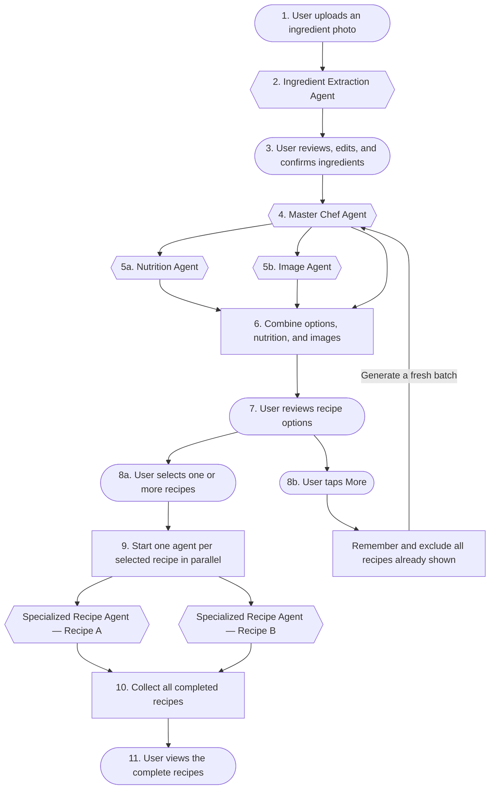

# Cook Mantra

## What is Cook Mantra?

Cook Mantra is a recipe generator for people who already have some ingredients at home but are not sure what to cook with them.

## How does it work?

The user takes a photo of the ingredients, Cook Mantra recognizes what is visible, and then asks the user to check the list. It also shows a separate list of common pantry ingredients such as salt, oil, turmeric, chilli powder, cumin, onion, garlic, and ginger. The user can confirm, add, edit, or remove anything before recipes are generated.

Once the ingredient list is confirmed, Cook Mantra suggests a few dishes, gives a short summary and nutrition estimate, and generates an image showing how each dish may look. The user can select one or more dishes. Cook Mantra then creates every selected recipe in parallel.

## Why we are building this

A lot of people have ingredients at home but still spend time wondering what to cook. This is especially common when there are only a few vegetables left, or when someone wants to avoid ordering food or wasting ingredients. I personally am a beginner at cooking and I want to learn new recipes with the already existing ingredients. I would want to try something different so for me this kind of app is perfect.

A photo alone is not enough, though. Some ingredients are usually kept in the kitchen and may not appear in the photo. At the same time, the app should not assume that every user has every common spice.

So the important idea here is simple: **Cook Mantra can suggest pantry ingredients, but the user must confirm them.**

## Who this is for

- Home cooks
- Students and people living alone
- Families deciding what to make quickly
- Beginners who need step-by-step instructions
- People trying to use ingredients before they go to waste

## The basic flow

1. The user uploads or takes a photo of the available ingredients.
2. The Ingredient Extraction Agent detects the likely ingredients.
3. Cook Mantra shows the detected ingredients to the user.
4. The user can add, rename, or remove detected items.
5. Cook Mantra also shows a separate, editable list of common pantry ingredients.
6. The user confirms which pantry ingredients are actually available.
7. The app creates one final confirmed ingredient list.
8. The Master Chef Agent generates a batch of recipe options using that confirmed list and excluding recipes already shown in the current session.
9. The Nutrition Agent estimates calories, macros, and useful diet tags.
10. The Image Agent creates an illustrative preview of how each dish might look.
11. The user selects one or more recipes or requests more options.
12. If the user requests more, steps 8–10 run again and produce a fresh batch without repeating previously shown recipes.
13. For each selected recipe, the backend starts a separate Specialized Recipe Agent. These agents run in parallel.
14. Each agent creates one complete recipe with quantities, steps, cooking time, servings, tips, and substitutions. The backend collects the results and returns all selected recipes together.

The user should also be able to go back and choose another recipe without uploading the image again.

## User and agent flow

Rounded nodes are user actions, rectangles are orchestration steps, and hexagons are agents.

## One rule we should not break

Cook Mantra must not quietly treat an ingredient as available just because it is common.

Every item should have a source:

- **Detected** — found in the uploaded photo
- **Pantry suggestion** — suggested by Cook Mantra because it is commonly used
- **User added** — manually entered by the user

Only ingredients confirmed by the user should be treated as available.

When a recipe needs something else, Cook Mantra should clearly mark it as:

- Missing
- Optional
- Replaceable with a substitution

## Common pantry ingredients

For the first version, the suggested pantry list may include:

- Salt
- Pepper powder
- Oil or ghee
- Chilli powder
- Onion
- Garlic
- Ginger

This is only a starting list. The user can select, deselect, add, or remove items. Later, the list can change based on cuisine, region, diet, and the user's saved pantry.

## What the first version should include

- Uploading an image from the camera or gallery
- Detecting ingredients from the image
- Showing uncertain detections clearly
- Letting the user add, edit, and remove ingredients
- Showing pantry suggestions separately from image detections
- Requiring confirmation before recipe generation
- Generating several recipe options
- Showing recipe name, summary, time, difficulty, and ingredient fit
- Showing missing or optional ingredients honestly
- Nutrition estimates and diet tags
- An AI-generated dish preview clearly marked as an illustration
- Selecting one or more recipe options
- Complete recipes for every selected option, generated in parallel
- The ability to return to the recipe options
- The ability to request more recipe options without re-uploading the image or repeating previously shown recipes

## What each agent does

### Ingredient Extraction Agent

Looks at the uploaded image and returns likely ingredients, confidence levels, and uncertain items.

### Confirmation screen

This is not really an AI agent, but it is one of the most important parts of the product. It lets the user review detected ingredients and pantry suggestions before anything else happens.

### Master Chef Agent

Creates different recipe ideas from the confirmed ingredients and the user's preferences. It should avoid hiding extra ingredient requirements. Also mentions from which is the dish from. (This country information will then be used inside [Specialized Recipe Agent](#specialized-recipe-agent)). Also this agent is a master in knowing about the taste of dishes and ingredients, so the agent will know how to properly analyse the ingredients in terms of giving the best taste.

### Nutrition Agent

Provides estimated calories, macros, diet labels, and possible allergen information. These values should be shown as estimates, not medical advice.

### Image Agent

Generates a visual interpretation of the proposed dish. The result should be labelled as an AI-generated illustration because the user's final dish may look different.

### Specialized Recipe Agent

Takes one selected recipe and turns it into something the user can actually cook. The backend starts a separate instance for every selected recipe and runs those instances in parallel. Each agent specializes in the recipe's cuisine and dish, and provides ingredients, quantities, numbered steps, servings, cooking time, tips, and substitutions. The backend collects all completed recipes before returning them to the user.

## Main product requirements

- The user must see the recognized ingredients before recipes are generated.
- Detected ingredients must be editable.
- Pantry ingredients must be shown separately and must also be editable.
- The user must explicitly confirm the final ingredient list.
- Recipe cards should include a short summary, time, difficulty, nutrition estimate, and dish preview.
- Missing and optional ingredients must be visible.
- Dietary preferences should be respected where possible.
- Possible allergens should be highlighted.
- A generated recipe should include quantities, numbered steps, time, servings, and substitutions.
- The user must be able to select one or more recipe options.
- The backend must run one Specialized Recipe Agent per selected recipe in parallel and return the completed recipes together.
- Requests for more recipe options must exclude every recipe already shown in the current session.
- Errors should fail gracefully. For example, if image recognition is weak, the user should still be able to enter ingredients manually.

## A few simple user stories

### Checking the recognized ingredients

As a user, I want to see what Cook Mantra detected so I can fix mistakes before it recommends anything.

This works when the ingredients are shown in an editable list, uncertain items are marked, and I can add or remove anything.

### Confirming pantry items

As a user, I want to confirm normal kitchen ingredients that may not be visible in my photo.

This works when pantry suggestions are separate, every item can be selected or removed, and only confirmed items are used in recipes.

### Choosing what to cook

As a user, I want a few clear recipe choices so I can decide quickly.

This works when each option shows what the dish is, how long it takes, how difficult it is, what may be missing, a nutrition estimate, and an illustrative image.

### Following the recipe

As a user, I want complete recipes for every option I select.

This works when each selected option is handled by a separate Specialized Recipe Agent, the agents run in parallel, and every returned recipe includes proper quantities, numbered instructions, cooking time, servings, substitutions, and clear assumptions.

## Risks we should keep in mind

- **Wrong ingredient detection:** reduce this with mandatory user review.
- **Assumed pantry ingredients:** never add them without confirmation.
- **Unrealistic dish previews:** label them as illustrative.
- **Wrong nutrition expectations:** make it clear that the values are estimates.
- **Diet or allergen mistakes:** highlight uncertainty and ask for user preferences.
- **Repeated recipe suggestions:** remember previous options and exclude them from every later batch in the session.
